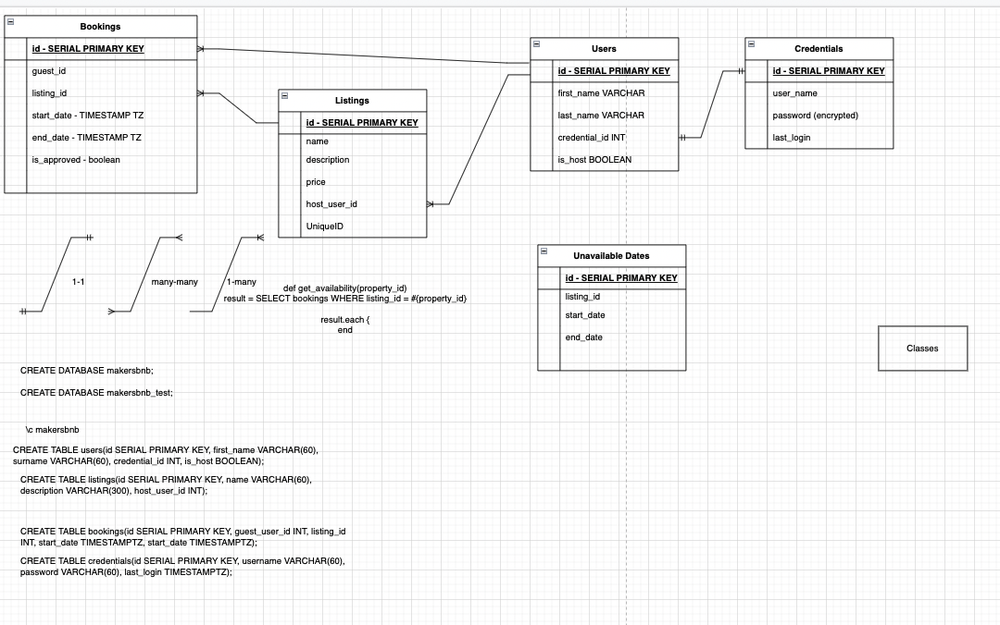
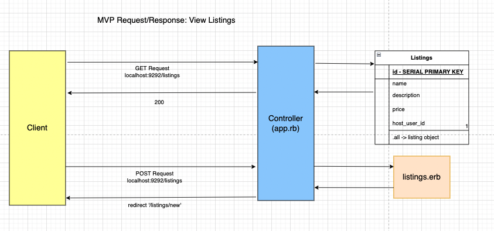
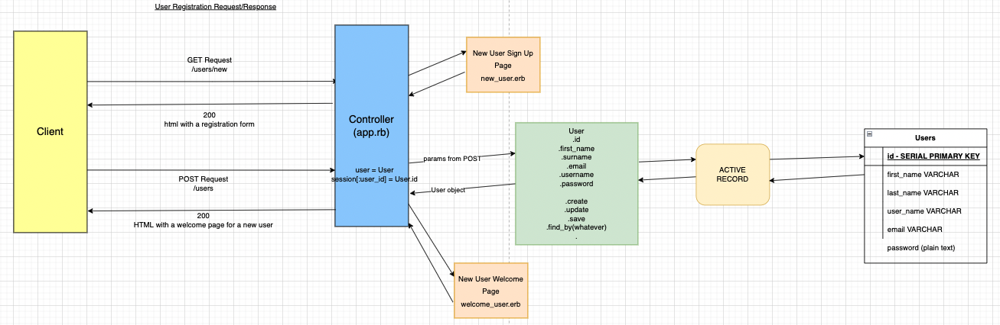

MakersBnB
=========

We are building a short-term rental website for travellers going away. Our platform allows hosts to list the properties that they would like to rent out to guests, and for guests to pick their preferred choice of rental. The platform allows hosts to manage their diary, approve specific booking requests and more.

## Installation
-----

- Fork this repository to your account
- Clone and setup the forked repository with:
```
git clone [path to your fork]
cd makersbnb
bundle install
```

## Database Setup
-----

These steps assume you have already installed [PostgreSQL](https://www.postgresql.org/download/)

The databases for this app are configured via Rake
If you wish to view the migrations they are available in the [Migrations Folder](/db/migrate)

```
rake db:create:all
rake db:migrate
rake db:migrate RACK_ENV=test
```
If you wish, you can then verify that the databases and  tables have been created using ```psql``` on your commandline.

## Running the Program
-----

- Run ```rackup``` in the terminal to start the server
- Visit [localhost:9292](http://localhost:9292/listings) in your browser 


## Running Tests
-----

Follow these steps to run the tests after all the gems have been installed:
```
cd makersbnb
rspec --format documentation
```

[Expected Output](#example-test-output)

## Overview of Functionality
-----

### The user is able to:
  - sign-up and create an account
  - sign-in/sign-out
  - view all the available properties 
  - view details about each property
  - list a property/properties
  - book a property
  - see the availability
  - choose a start-date/end-date 
  - see the total price of the requested dates
  - request a booking
   
## Steps taken in order to build the application
-----
1. MVP which consisted of:
    - spec
    - user stories 
    - low-fidelity wireframe
    - database domain modeling
    - barebones functional website
      - list of properties
      - view single property
2. Installing the relevant gems
3. Using the MVC design pattern
4. Implementing feature and unit tests before writing any line of code

## Team Approach
-----

- Followed XP principles
- utilised mutliple technologies
  - Trello Board
  - Slack Channel
  - Zoom telecommunications
  - Google Drive
    - Docs
    - Sheets
  - Github workflow
    - User stories delegated to pairs
    - Branches kept separated
    - Pull Requests submitted for review
  - Changes merged to main once approved
- Daily Stand-ups
- Daily Retros

## User Stories
-----

```
As a host,
So that I can make money,
I would like to list my property.

As a hosts,
So that I can view my listings,
I would like to create an account.

As a host,
So I can make even more money,
I would like to list multiple properties.

As a host,
So that I can keep track of my listings,
I would like to name my listings.

As a host,
So that my guests have some information,
I would like to add a description to my listing.

As a host,
So that my guests know the cost,
I would like to add a price to my listing.

As a host,
So that my property isn’t double-booked,
I would like to prevent my guests from booking unavailable dates.

As a user,
So that I’m only looking at relevant information,
I would like to sign in to my account

As a guest,
So that I have a roof over my head,
I would like to request a space for a particular night

As a host,
So that I’m in control of my space,
I would like to be able to confirm a guest request 

As a guest,
So that I know when I can book,
I would like to see available dates for a property.

As a guest,
So that I know when I cannot book
I would like to see unavailable dates grayed out

As a host,
So that I don’t lose out on bookings
I would like my property to remain available until confirmed
```
-----

## Technologies
- Ruby
- Sinatra
- Capybara
- PostgreSQL
- Rake | Active Record
- BCrypt
- Git
- HTML | CSS
- SimpleCov
- Rubocop

## Domain & Process Modelling
-----







## Appendix
-----

### Example Test Output

```
User can add a new space
  User should be able to describe their listing
  A user that isn't signed in will be redirected

All Requests
  not signed in
    should prompt user to sign in
  signed in
    should display basic information
    guest booking requests
      should display guest bookings
    host booking requests
      should display host requests
      should view requests

User Registration
  user can create an account
  user cannot create an account without username

Home Page
  redirects to listings

navbar can navigate through all pages
  clicking on 'Listings from listings/new should return the user back to /listings
  clicking on 'Listings' after clicking 'view details' should return user back to /listings
  User should sign in and see Listings, Requests, Sign out buttons
  user clicks sign out and can see the following Listings, Sign up and Sign up

Guest requests booking
  Guest can request a specific property booking
  when host clicks on Approve it should post to /confirm
  when host clicks on Reject it should go to /requests

Sign In
  when a user provides correct details they can sign-in
  when a user provides incorrect details they cannot sign-in

Sign out
  User can sign out

Viewing All Listings
  Basic UI
  list listings

viewing an individual listing
  should display property info

requesting a booking
  should display request UI elements
  should show a quote and allow booking when listing is available
  should prevent booking when a property is not available
  should show a booking request

.all
  returns all listings

Listing
  should be able to create a new listing

available?
  should return true if listing is available
  should return false if listing is already booked

quote
  should return number of nights
  should return the price

User
  .authenticate
    when given correct email
      and correct password
        returns a User object
      and incorrect password
        returns nil
    when given incorrect email
      returns nil

Finished in 12.61 seconds (files took 1.78 seconds to load)
36 examples, 0 failures


COVERAGE:  99.05% -- 419/423 lines in 19 files

+----------+--------+-------+--------+---------+
| coverage | file   | lines | missed | missing |
+----------+--------+-------+--------+---------+
|  95.56%  | app.rb | 90    | 4      | 152-155 |
+----------+--------+-------+--------+---------+
18 file(s) with 100% coverage not shown
```